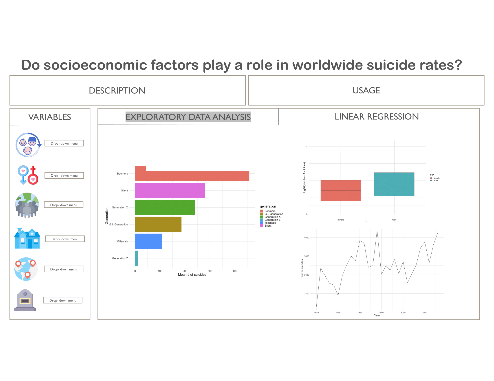
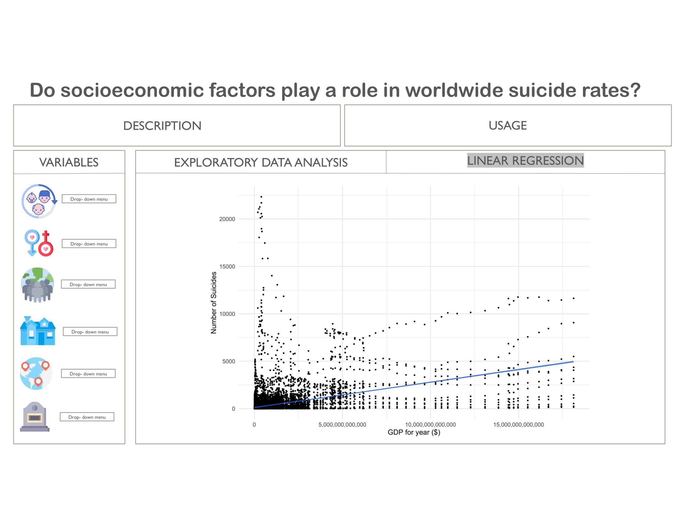

# Group_13
:star: Farnaz and Racquelle :star: 

## Suicide Rates Overview 1985 to 2016

### Introduction

This compiled dataset pulled from four other datasets linked by time and place was built to find signals correlated to increased suicide rates among different cohorts globally, across the socio-economic spectrum. The inspiration for this study was to prevent suicide. This data set includes 11 columns and provides information about country, year, sex, age group, count of suicides, population, suicide rate, country-year composite key, gdp_for_year, gdp_per_capita, generation (based on age grouping average).

The references for this study are:

- [United Nations Development Program. (2018). Human development index (HDI)](http://hdr.undp.org/en/indicators/137506)

- [World Bank. (2018). World development indicators: GDP (current US$) by country:1985 to 2016](http://databank.worldbank.org/data/source/world-development-indicators#)

- [Szamil. (2017). Suicide in the Twenty-First Century dataset](https://www.kaggle.com/szamil/suicide-in-the-twenty-first-century/notebook)

- [World Health Organization. (2018). Suicide prevention](http://www.who.int/mental_health/suicide-prevention/en/)

## Milestone 1
Our exploratory data analysis can be found [here](https://stat547-ubc-2019-20.github.io/group_13/docs/suicide-data.html). 

## Milestone 2
**(1)** Ensure the following packages are installed:

````
tidyr
dplyr
ggplot2
here
tidyverse
docopt
glue
````

**(2)** Our Rscripts to load, process, and conduct exploratory data analysis can be fould in the links below:

  1. [load_data.R](https://github.com/STAT547-UBC-2019-20/group_13/blob/master/src/load_data.R): This loads the raw data file into a CSV.
  
  2. [process_data.R](https://github.com/STAT547-UBC-2019-20/group_13/blob/master/src/process_data.R): Cleaned data via omitting NAs and   eliminating one of the columns. 
  
  3. [EDA_script.R](https://github.com/STAT547-UBC-2019-20/group_13/blob/master/src/EDA_script.R): Performed exploratory data analysis of our cleaned dataset.
  
 To replicate this analysis, clone this repository, navigate to the `src` folder in your terminal, and type in the commands below:
 
````
Rscript src/load_data.R --url_to_read="https://raw.githubusercontent.com/STAT547-UBC-2019-20/data_sets/master/suiciderates.csv"
 
 Rscript src/process_data.R --url_to_read="https://raw.githubusercontent.com/STAT547-UBC-2019-20/data_sets/master/suiciderates_clean.csv"
 
 Rscript src/EDA_script.R --url_to_read="https://raw.githubusercontent.com/STAT547-UBC-2019-20/data_sets/master/suiciderates_clean.csv"

````
 
 ## Milestone 3
 **(1)** Ensure the following packages are installed:

````
tidyr
dplyr
ggplot2
here
tidyverse
docopt
glue
````

**(2)** Our Rscripts for linear regression of our dataset, and knitting final report. 

 4. [linear_regression.R](https://github.com/STAT547-UBC-2019-20/group_13/blob/master/src/linear_regression.R)
  
 5. [knit.R](https://github.com/STAT547-UBC-2019-20/group_13/blob/master/src/knit.R)
  
 To replicate this analysis, clone this repository, navigate to the `src` folder in your terminal, and type in the commands below:

````
Rscript src/linear_regression.R --url_to_read="https://raw.githubusercontent.com/STAT547-UBC-2019-20/data_sets/master/suiciderates_clean.csv"

Rscript src/knit.R --final_report="docs/final_report.Rmd" 
````
**(3)** Usage for GNU Make

## Milestone 4

**Dashboard Proposal**

# Dashboard Description

In this app you can find information on how socio-economic factors play an important role in the number of suicide rates in different countries and how they change between 1985 to 2016. There are 4 plots that show how suicide rates change according to changes in socio-economic factors. The bar chart provides information on how Generation can affect the number of suicides. Another bar chart provides information on how suicide rates change according to sex. The line graph is very informative in interpreting how suicide numbers change across different years (between year 1985-2016). Our linear regression is looking at how number of suicides correlate to GDP for year. This dashboard has a dropdown menu that will essentially allow the user to choose another variable rather than what is shown on the plots. As an example the user can change country instead of generation in the fist plot and see how that is related to number of suicides. 

# Usage Scenario

David is a sociologist who is interested in the assessment and prevention of suicide as part of his major. He is wondering how different socio-economic variables can affect suicide rates. He is also curious to know if those socio-economic factors intersect together. One day he is searching on the web and he finds our app that provides information on how socio-economic variables interact with the number of suicides.

# App Sketch

Below please find our dashboard sketches. Icons were taken from [FLATICON](https://www.flaticon.com/):




